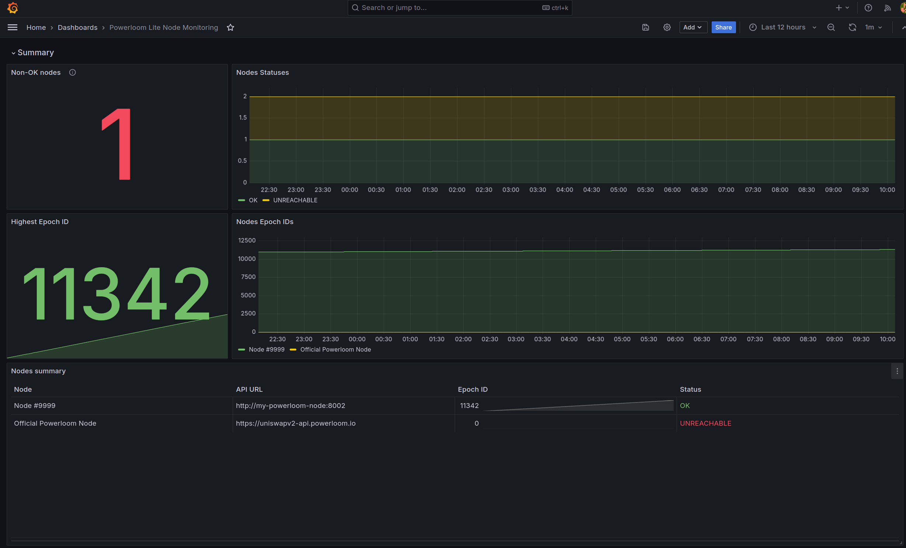
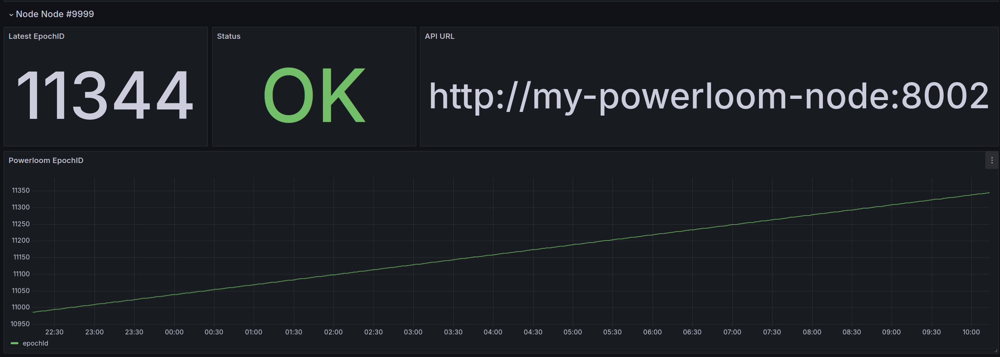

# Prometheus Powerloom Exporter

The **Prometheus Powerloom Exporter** is a service that scrapes data from Powerloom nodes' core APIs and exports the metrics to a Prometheus-compatible endpoint. It also provides a ready-to-use Grafana dashboard for visualization and supports multi-node monitoring.

## Features

- **Multi-node support**: Easily configure multiple Powerloom nodes to scrape metrics from.
- **Prometheus endpoint**: Exports metrics that can be scraped by Prometheus.
- **Grafana dashboard**: Pre-configured dashboard provided for visualizing the scraped data.
- **Docker support**: Deploy the entire stack (Exporter, Prometheus, Grafana) using a `docker-compose.yaml` manifest.
- **Custom configurations**: Easily customizable through `config.yaml` and optional `.env` file.

## Screenshots

- **Summary Section:**
  

- **Node Overview:**
  

## Table of Contents

- [Quick Start (Docker)](#quick-start-docker)
- [Configuration](#configuration)
  - [Configuring Nodes](#configuring-nodes)
  - [Environment Variables](#environment-variables)
- [Running from Source](#running-from-source)
- [Grafana Dashboard](#grafana-dashboard)
  - [Included Grafana Dashboard](#included-grafana-dashboard)
  - [Exporting the Dashboard](#exporting-the-dashboard)
  
## Quick Start (Docker)

To quickly get up and running with the Prometheus Powerloom Exporter, Prometheus, and Grafana, you can use the provided `docker-compose.yaml` manifest. 

### Prerequisites

- Docker installed
- Docker Compose installed

### Steps

1. **Clone the repository:**
    ```bash
    git clone <repository_url>
    cd prometheus-powerloom-exporter
    ```

2. **Edit the configuration:**
   - Modify the `config.yaml` file to point to your Powerloom nodes.
   - Optionally, copy and modify the `example.env` file to `.env` if you need to customize the default behavior.

    ```bash
    cp docker/example.config.yaml docker/config.yaml
    cp docker/example.env docker/.env
    # Edit docker/config.yaml with your node details
    ```

3. **Run the docker-compose stack:**
    ```bash
    docker-compose -f docker/docker-compose.yaml up -d
    ```

4. **Access the services:**
   - **Prometheus** will be available at `http://localhost:9090`
   - **Grafana** will be available at `http://localhost:3000`
   - Default Grafana login credentials:
     - Username: `admin`
     - Password: `admin`

## Configuration

### Configuring Nodes

The Powerloom nodes to be monitored should be configured in the `docker/config.yaml` file. You can define multiple nodes like so:

```yaml
nodes:
- name: "My node #1"
  url: http://<your_node_ip_address_or_hostname>:<your_node_port>
- name: "My node #2"
  url: http://<your_node_ip_address_or_hostname>:<your_node_port>
```

Place this configuration in the `docker/config.yaml` file before starting the service.

### Environment Variables

You can customize the behavior of the exporter using environment variables defined in the `docker/.env` file. An example `.env` file is provided in `docker/example.env`.

```bash
PROMETHEUS_PORT=8000      # The port where the exporter will run
SCRAPE_INTERVAL=30        # Scrape interval in seconds
```

These environment variables are optional, and if the `docker/.env` file is missing, reasonable defaults will be used.

## Running from Source

If you'd prefer to run the exporter directly from the source code, follow these steps:

### Prerequisites

- Python 3.x installed
- Pip package manager installed

### Steps

1. **Clone the repository:**
    ```bash
    git clone <repository_url>
    cd prometheus-powerloom-exporter
    ```

2. **Install dependencies:**
    ```bash
    pip install -r src/requirements.txt
    ```

3. **Configure the application:**
    - Create a `config.yaml` file based on the provided `example.config.yaml`.
    - Optionally, create a `.env` file from `example.env` to customize environment variables.

    ```bash
    cp docker/example.config.yaml config.yaml
    cp docker/example.env .env
    # Edit config.yaml with your node details
    ```

4. **Run the exporter:**
    ```bash
    python src/prometheus_exporter.py
    ```

The exporter will start and expose metrics on the port defined in the `.env` file or default to `8000`.

## Grafana Dashboard

### Included Grafana Dashboard

The provided `docker/grafana/dashboards/powerloom-dashboard.json` is a pre-configured dashboard for visualizing Powerloom metrics. This dashboard is automatically imported into Grafana when using the `docker-compose.yaml` manifest. 

To view the dashboard:
- Navigate to Grafana (`http://localhost:3000`)
- Look for the "Powerloom Dashboard" in the list of available dashboards.

### Exporting the Dashboard

If you already have an existing Grafana instance and want to import the dashboard, use the `export/grafana/exported_grafana_dashboard.json` file. This dashboard is the exported version of the one tailored for the included Grafana instance.

To import it into an existing Grafana setup:
1. Log into Grafana.
2. Go to **Dashboards > Import**.
3. Upload the `export/grafana/exported_grafana_dashboard.json` file.

## License

This project is licensed under the MIT License. See the [LICENSE](./LICENSE) file for more details.

---

Happy monitoring!